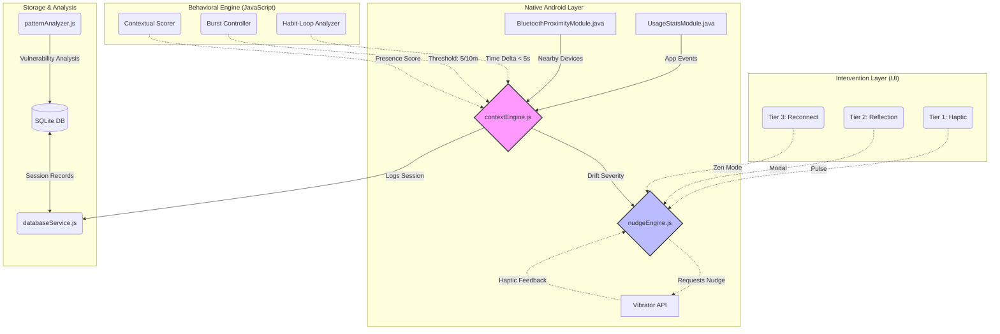

# Presence Pulse 📱✨
> **Detect. Reflect. Reconnect.** — Evolving from reactive metrics to proactive coaching.

Presence Pulse is a high-performance **Behavioral Intelligence** app for Android. It doesn't just track screen time; it decodes the **psychological "why"** behind your phone habits. By analyzing micro-picks, social context, and app categories, it builds a personalized **Behavioral Blueprint** to help you reclaim your focus.

---

## 🏗️ Technical Architecture

The app is built with a unique hybrid architecture, combining native Android background tracking with a high-level JavaScript Behavioral Engine and Gemini 1.5 Pro intelligence.



---

## 🚀 The Proactive Engine (Latest Features)

We have moved beyond simple "reactive" screen time tracking. The new **Proactive Engine** uses deep context to provide meaningful interventions:

### 🧠 Trigger Fingerprint
Uses **Gemini 1.5 Pro** to classify your 7-day usage into psychological profiles: **Boredom, Anxiety, Pure Habit, Notification,** or **Social Curiosity**.

### 🏷️ Context-Aware Filtering
Classifies apps into **Distraction** (Social/Games) vs. **Utility** (Maps/Work). Your Presence Score only takes a hit when you drift into distraction apps.

### 🛡️ Privacy-First Zen Mode
One-tap tracking pause. When you're in "Zen Mode," the engine stops all tracking and database writes, giving you absolute privacy when you need it.

### 👥 Social Context (Whitelisted Devices)
Detects nearby Bluetooth devices. If you're near a **Whitelisted Friend**, the phubbing penalty is increased. If you're in a public space (unrecognized devices), the penalty is reduced by 50%.

### 🧘 Forced Reconnection Gate
A mandatory **30-second Mindful Breathing** gate that triggers during severe "Attention Drifts," forcing a psychological reset before you can resume phone use.

---

## 📊 Feature Roadmap

| Phase | Title | Description |
|---|---|---|
| **P1** | **Usage Tracking** | Native bridge to Android `UsageStatsManager` for real-time app events. |
| **P2** | **SQLite Cloud** | Local persistence for all behavioral sessions and daily metrics. |
| **P3** | **Social BLE** | Bluetooth LE scanning to detect "Phubbing" (phone use with friends). |
| **P4** | **AI Insights** | Daily coaching insights via the **Gemini 1.5 Pro** API. |
| **P5** | **Timeline UI** | Vertical 24-hour visual scroll of your attention history. |
| **P6** | **Nudge Engine** | Escalating interventions: Haptic → Reflection → Reconnect. |
| **P7** | **Pattern Intel** | Vulnerable hours, trigger apps, and 7-day presence heatmaps. |

---

## 🛠️ Setup & Installation

### 1. Prerequisites
*   **Node.js**: v22.11.0+
*   **JDK**: 17 (set as `JAVA_HOME`)
*   **Android Studio**: Latest stable (with Android 14 / API 34 SDK)

### 2. Local Setup
```powershell
# Clone and enter the project root
git clone https://github.com/dristicg/faltu
cd PresencePulse/PresencePulse

# Install dependencies
npm install

# Build for Android
npx react-native run-android
```

### 3. Phone Configuration (CRITICAL)
For tracking to work, you MUST grant the following on your Android device:
1.  **Usage Access**: `Settings > Apps > Special Access > Usage Access > PresencePulse`
2.  **Nearby Devices**: Enable Bluetooth permissions for social detection.
3.  **Battery**: Set Battery usage to **"Unrestricted"** so the background tracking isn't killed.

---

## 🛠️ Tech Stack
*   **Frontend**: React Native (0.84.0), TypeScript
*   **Intelligence**: Google Gemini 1.5 Pro
*   **Storage**: SQLite (`react-native-sqlite-storage`)
*   **Native**: Java (UsageStats, Vibrator, BLE)
*   **Styling**: Glassmorphism, Dark Mode, Neon Animations

*Built with ❤️ for a more present life.*
